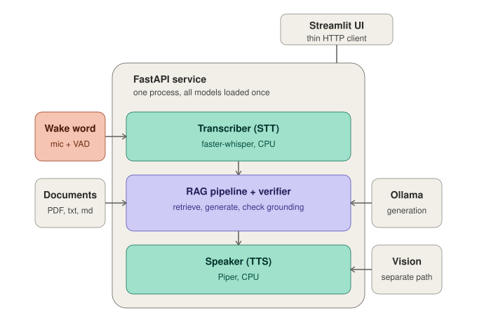

# Personal Document Voice Assistant (PDVA)

Speak a question, get a spoken answer grounded in your own documents. Runs
entirely locally: faster-whisper (STT) → ChromaDB + all-MiniLM-L6-v2
(retrieval) → llama3.2:3b via ollama (generation) → Piper (TTS), orchestrated
by a FastAPI service with a Streamlit UI.

## Hardware assumptions

Tested on an NVIDIA GTX 1080 Ti (11GB VRAM, Pascal architecture). The GPU is
used only by ollama for LLM inference; STT and TTS run on CPU by design, so
no CUDA setup is needed in this project's own venv. If you use a different
NVIDIA GPU generation, note that Pascal requires cuDNN 8 — cuDNN 9 dropped
support for compute capability < 7.5.

## Layout

    pdva/
      types.py               shared dataclasses: Passage, RAGAnswer, TranscriptSegment
      config.py               shared settings: paths, model names, chunk sizes, RAG_TOP_K
      embedding_index.py      Week 4: DocumentIndex (embedding + retrieval)
      llm.py                  Week 5: LocalLLM (ollama wrapper)
      rag.py                  Week 6: RAGPipeline (grounded answering)
      transcriber.py          Week 7: Transcriber (speech-to-text)
      tts.py                  Week 8: Speaker (text-to-speech)
      vision.py               Week 9: VisionModel (optional, image questions)
      assistant.py            Week 10: Assistant (owns the loaded models, one per process)
      verifier.py             Week 10: VerifiedRAGPipeline (flags ungrounded claims, abstains when context doesn't bear on the question)
      edge_speaker.py         Week 11 (optional): EdgeSpeaker, same interface as Speaker,
                              backed by an HTTP call to a Jetson-hosted Piper service
      jetson_tts_service.py   Week 11 (optional): Flask app that runs ON the Jetson
                              (JetPack 4.6 / Python 3.6), not part of the workstation venv —
                              wraps the piper CLI binary, exposes /health and /synthesize

    service/
      app.py                  Week 10: FastAPI service orchestrating all modules

    ui/
      streamlit_app.py        Week 10: Streamlit interface (thin client of the service)

    demo_voice.py             Standalone capture + wake word + STT sanity check
                              (mic → openWakeWord "jarona" → VAD → faster-whisper).
                              Prints the recognized question only — does not call
                              RAGPipeline/LocalLLM/Speaker. Useful for verifying the
                              mic, wake word, and STT independently of the full service.

    eval/
      evaluate.py             Retrieval and answer-quality scoring against the GOLD set
      bench_latency.py        Per-stage latency benchmark (the Week 12 deliverable)
      edge_latency.py         Week 11 (optional): local vs. Jetson TTS latency comparison

    docs/
      architecture.svg        System diagram: service process, RAG+verifier pipeline,
                              wake listener, optional vision path

    tests/
      test_week4_index.py ... test_week10_assistant.py

## Architecture

## Setup

Requires Python 3.11 and [uv](https://docs.astral.sh/uv/). 

Dependencies are locked in `uv.lock`, which resolves both Linux and macOS from one file — the
same command works on the workstation and the laptop:

    uv sync --frozen              # core system
    uv sync --frozen --extra voice   # ...plus the wake-word loop

`--frozen` installs exactly what is locked and fails if `uv.lock` has drifted
from `pyproject.toml`. Regenerate the lock on the **Linux workstation only**
(`uv lock`); uv resolves every platform from that one run, so committing a
Mac-generated lock will silently drop the CUDA-side pins.

On Linux, torch comes from the cu118 index because the 1080 Ti is Pascal
(SM 6.1) and needs the cuDNN 8 build. On macOS that pin does not apply and uv
takes CPU/MPS wheels from PyPI.

Activate virtual environment by running:
    `source .venv/bin/activate`

Download the wake-word feature-extraction models (not bundled with the
openWakeWord pip package — required before `demo_voice.py` or any wake-word
code will run):

    python -c "import openwakeword.utils; openwakeword.utils.download_models()"

Install the ollama app from https://ollama.com, then pull the model:

    ollama pull llama3.2:3b

Download the Piper voice into the project root (the .onnx and .onnx.json
files must sit next to each other):

    python -m piper.download_voices en_US-lessac-medium

STT and TTS run on CPU by design; the GPU is dedicated to the LLM. No CUDA
setup is required beyond ollama's own.

## Running the assistant

Two terminals, from the project root:

    uv run uvicorn service.app:app --port 8080     # terminal 1: the service
    uv run streamlit run ui/streamlit_app.py       # terminal 2: the UI

Open http://localhost:8501. In the sidebar, upload .txt/.md/.pdf documents
and click "Index uploads". Then ask a question — by typing, or by recording
in the Voice tab (requires a browser with microphone access; Streamlit
>= 1.39). Toggle "Speak answers" to hear responses read aloud.

Each answer shows its sources and a per-stage latency breakdown
(stt / retrieve / generate / tts) against the 3-second budget.

To sanity-check the mic, wake word, and STT independently of the full
service:

    python demo_voice.py

## Running across two machines

For a demo where the mic is on a laptop and the models stay on the
workstation. The UI is a thin HTTP client, so only the service needs the GPU.

Workstation — bind to the LAN instead of loopback:

    uv run uvicorn service.app:app --host 0.0.0.0 --port 8080
    sudo ufw allow 8080/tcp        # if ufw is active

Laptop — point the UI at the workstation:

    PDVA_API_URL=http://<workstation-ip>:8080 uv run streamlit run ui/streamlit_app.py

ollama stays on `127.0.0.1`; only the FastAPI service is exposed. No CORS
configuration is needed, because Streamlit calls the API server-side.

Caveat for the latency deliverable: `total_s` is measured inside the service
and therefore excludes the audio upload and the TTS download. Over the lab
network that round-trip is real. Record wall-clock time in the UI as well and
report the difference as a separate `network_s` stage rather than folding it
into `total_s`.

## Evaluation

    uv run python eval/evaluate.py

This runs each GOLD question 5 times (answers are sampled, not deterministic)
and reports a pass rate rather than a single pass/fail, since a single run
can't distinguish a solid answer from a borderline one that happened to land
well. Current numbers on the reference document set: 10/10 retrieval hits,
9/10 answer-quality rows passing all 5 runs, 98% mean answer pass rate.

`evaluate_qa`'s `must_contain` field accepts either a single required phrase
or a tuple of acceptable phrases — used where a correct answer can be phrased
several ways (e.g. either the canned refusal sentence or a specific grounded
negation both count as correct for a question the documents don't address).

For per-stage latency, use `time_text_turn_by_stage` in the same file against
a **warm** model — the first call after the service starts pays a one-time
Ollama model-load cost (1–2.5s) that isn't representative of steady-state
turns. Report warm numbers (typically ~370ms retrieve+generate on the 1080
Ti) against the 3s budget, not the cold-start figure.

## Tests

    python tests/test_week4_index.py   # ... through test_week9_vision.py
    uv run pytest tests/test_week10_assistant.py -q

PASS/TODO/SKIP/WARN/FAIL semantics: SKIP means a prerequisite is missing
(e.g. ollama not running) — the suites are safe to run anytime. The Week 10
tests use fake components and need no models.

## Troubleshooting

- Sidebar says "Service unreachable": terminal 1 isn't running, or crashed —
  check its output.
- Transcript comes back empty or as "You": the recording is silent — check
  browser mic permissions and OS input device/gain.
- `LLM ❌` in the sidebar: ollama isn't running or the model isn't pulled.
- `NoSuchFile` error loading `melspectrogram.onnx` (openWakeWord): the
  feature-extraction models weren't downloaded — run the
  `download_models()` command in Setup above.

  ## Known limitations

- **Small-model refusal inconsistency.** On questions where the retrieved
  passages are topically related to the question but don't address the
  specific property asked (e.g. a passage about a species' markings, asked
  about venom), llama3.2:3b sometimes answers from the adjacent passage
  instead of refusing, rather than recognizing the passage doesn't bear on
  the question. The system prompt was tightened to make "bears on the
  question" concrete (same subject ≠ relevant), which fixed the most
  incoherent failure mode, but the underlying refusal decision remains
  flaky (~1 in 5 samples) on this class of question. Believed to be a
  capability ceiling of a 3B model rather than a fixable prompt issue —
  a larger model or a stricter retrieval-score threshold would likely
  help.
- **Retrieval tail is noisy on a small corpus.** With `RAG_TOP_K` set too
  high, the lowest-ranked "relevant" passages can have similarity scores
  barely above unrelated documents, occasionally pulling in an off-topic
  chunk. Lowering `RAG_TOP_K` resolved this in testing; if you add many
  more documents, re-check the score gap at the tail of `k`.
